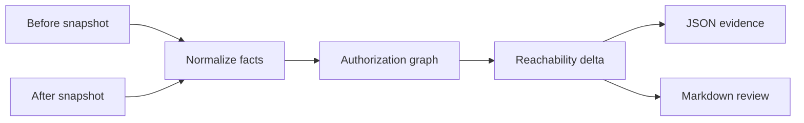

# Architecture

## System boundary

Release 0 accepts two immutable local snapshots: `before/` and `after/`. Each contains workflow YAML, a Terraform/OpenTofu plan JSON, and Kubernetes RBAC YAML. The analyzer does not call AWS, GitHub, or a cluster.



## Graph semantics

Nodes are typed identities or capabilities:

- GitHub OIDC subject pattern
- IAM role ARN
- EKS cluster and Kubernetes group
- Kubernetes binding and role
- Kubernetes API capability

Edges are added only from supported, declared inputs. A reachable capability is emitted only when the evaluator can traverse every edge without a missing or unsupported semantic.

The analyzer compares sets of reachability records:

`(subject-pattern, role-arn, cluster-id, namespace-or-cluster, api-group, resource, verb)`

`after − before` is the candidate authorization delta.

## Why it does not simulate IAM permissions

AWS policy evaluation combines policy types and request context. Resource policies, boundaries, SCPs/RCPs, session policies, and condition keys can change the result. The AWS policy simulator itself warns that its result can differ from the live environment. Release 0 therefore does not label any tuple as AWS effective permission.

## Input contract

The command will require explicit paths:

```text
authz-delta compare \
  --before fixtures/revisions/before \
  --after fixtures/revisions/after \
  --format json \
  --output report.json
```

The path layout and JSON schema must be versioned before the CLI is implemented.

## Security properties

- local, read-only analysis;
- no credential requirement;
- no execution of supplied configuration;
- deterministic output and input hashes;
- diagnostics for unsupported configuration rather than false negatives.

## Explicit non-goals

No remediation, no automatic PR merge/blocking, no managed SaaS service, no live cloud querying, and no AI authorization decision engine in the first release.
